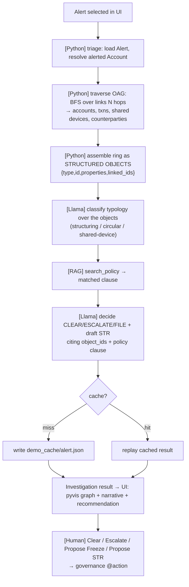
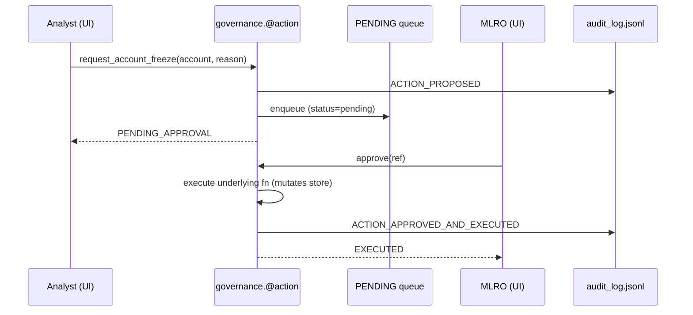
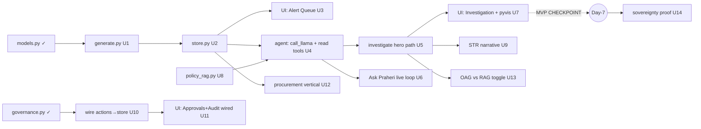

# feat: Praheri — Sovereign AIP on Llama (full hackathon build plan)

**Created:** 2026-06-25
**Type:** feat · **Depth:** Deep
**Origin:** `CLAUDE.md`, `BUILD_BIBLE.md`, `PROMPT_PLAYBOOK.md` (the kit is its own spec)
**Event:** Meta–Reliance Intelligence Hackathon, 10 July 2026 · solo build · ~15-day runway

---

## Summary

Build **Praheri**, a sovereign AML investigation copilot, by filling in a partially-scaffolded
Python/Streamlit kit. The hero deliverable is a deterministic, demo-stable **investigation pipeline**:
Python triages an alert and traverses an ontology of accounts/transactions/devices to assemble a fraud
ring as **structured objects (OAG)**, and **Llama 3.1 8B (local, via Ollama)** classifies the typology,
decides CLEAR/ESCALATE/FILE, and drafts a Suspicious Transaction Report citing `object_id`s. High-stakes
actions route through an audited approval gate. A second **procurement** vertical and an **OAG-vs-RAG**
toggle prove the platform thesis, and an "airplane-mode" run proves sovereignty.

The plan is weighted to reach the **Day-7 MVP checkpoint (pick alert → ring lights up) before any polish**,
and to spike the risky Llama+OAG bit early. It expands all seven playbook phases into dependency-ordered
implementation units with file paths, approach, and test/verification scenarios — grounded in what the
scaffold already provides.

---

## Problem Frame

The hackathon's losing move is "a Llama chatbot for X" — the model is interchangeable and the demo is a
toy. The winning move (per `BUILD_BIBLE.md` §1) is the **Palantir stack**: a typed **ontology**, a governed
**action layer**, and **governance/audit in the runtime** — with the wedge that in Indian BFSI, sending
customer data to a foreign API is *illegal* (RBI localization), so on-prem open-weight **Llama** is the only
compliant architecture. Praheri is AML vertical #1 on a reusable "Sovereign AIP" platform; procurement is
vertical #2.

**This is a demo**, judged on demoability + sovereignty narrative. Optimize for a flawless 3-minute demo,
not production completeness. Synthetic data only; framed as decision-support, never a certified AML system.

### What the scaffold already gives us (grounding)

| File | State | Implication for the plan |
|---|---|---|
| `praheri/models.py` | **Complete** — 7 Pydantic types, `LINKS`, `OBJECT_TYPES` | Playbook 1.1 is a thin verify/extend, not a build |
| `praheri/governance.py` | **Complete + runnable** — audit log, `@action`, approval gate, 5 actions | Phase 5 is mostly *wiring to the store + UI*, not building the engine |
| `praheri/store.py` | **Stub** (`NotImplementedError`) | Build fully (U2) |
| `praheri/generate.py` | **Stub** | Build fully (U1) |
| `praheri/agent.py` | `SYSTEM_PROMPT` + 3 read-tool specs done; `call_llama`, `investigate`, action tools stubbed | The risky spike (U4–U6) |
| `praheri/policy_rag.py` | **Stub** | Build (U8) |
| `app/streamlit_app.py` | Skeleton; **Approvals + Audit tabs already functional**; 3 tabs TODO | Wire Alert Queue, Investigation, Procurement |
| `policies/aml_thresholds.md` | **Present** — thresholds + 3 typologies + dispositions | RAG corpus is ready; matches the 3 planted rings |

### Validated external/empirical findings (Phase 1 research)

- **Ollama `/v1/chat/completions` tool-calling works on `llama3.1:8b`.** A live probe against the local
  server returned `finish_reason: tool_calls` with a well-formed `tool_calls[0]`. The scaffold's request
  shape is correct. (Ollama OpenAI-compat + [tool support](https://ollama.com/blog/tool-support).)
- **8B fabricates argument *values*.** In the same probe the model called `get_linked_objects` with
  `link_type:"transactions"` — **not a valid edge** in `models.LINKS` (real edges: `sends`/`receives`).
  This is the concrete justification for the hybrid architecture (KTD-1) and a hard design constraint on
  `get_linked_objects` (U2): it must normalize/tolerate loose `link_type` values, never assume the model
  passes an exact enum.

---

## Key Technical Decisions

### KTD-1 — Hybrid investigation pipeline (Python traverses, Llama reasons), plus a live tool-calling loop

The hero path `investigate(alert_id)` is **Python-orchestrated**: triage and ring-traversal are
deterministic code over the OAG store; **Llama does the genuinely-AI parts** — typology classification,
CLEAR/ESCALATE/FILE disposition, and the STR narrative — reasoning over the *structured objects* Python
hands it. This is faithful to golden rule #2 ("one Llama instance doing tool-calling across a deterministic
pipeline, not a swarm") and to how a real, auditable enterprise AML system works: the traversal procedure is
defined and reproducible; a regulator can be told exactly why the system looked where it looked.

**Separately**, we keep a genuine **model-driven tool-calling loop** behind an "Ask Praheri" free-form query
box (U6). There, Llama really does drive `query_objects`/`get_linked_objects`/`search_policy` in a multi-turn
loop. This gives judges a live "yes, the model is really calling tools" answer where an occasional retry is
acceptable (a human is interacting, not a scripted beat).

**Production-story alignment:** the platform supports full model-driven tool-calling; on the 8B laptop we
constrain orchestration for determinism; at **Llama 3.3 70B** production scale the model drives more of it.
True and defensible — the hybrid *is* the production architecture, downscaled. *(Rejected: pure
model-driven loop on the hero path — 8B multi-hop unreliability is exactly what dies on stage; the live
probe already showed it fabricating link types.)*

### KTD-2 — Golden-cache demo insurance on the hero path

First real `investigate()` per planted ring caches its result to disk (`demo_cache/<alert_id>.json`). If
Ollama stalls live, the hero beat replays from cache instantly. A visible **"Live / Cached"** indicator
keeps it honest. The Day-14 backup video remains the ultimate fallback. Cache is keyed by `alert_id` and
trivially bypassed/cleared for genuine live runs.

### KTD-3 — One agent + governance + store engine, reused by both verticals

Procurement (U12) introduces only a new tiny ontology and one action; it reuses `call_llama`, the governance
`@action`/approval/audit machinery, and the store pattern **unchanged**. The reuse *is* the platform thesis —
no forking the engine.

### KTD-4 — OAG vs RAG is a real, in-code difference, not a slide

The toggle (U13) sends the model **the same underlying ring** two ways: OAG = structured object dicts +
explicit links; RAG = the same objects flattened to text chunks with links stripped. Showing both answers
side-by-side makes the differentiator visible and defensible under questioning.

### KTD-5 — Deterministic generation; structured objects everywhere

`generate.py` seeds Faker/RNG for reproducible planted rings (golden rule: deterministic demo). Every store
read returns `{type, id, properties, linked_ids}` — never a string (golden rule #3, enforced in U2 tests).

---

## High-Level Technical Design

### Investigation pipeline (the hero path, U5)



### Governed action loop (already-built engine, U10–U11 wire it)



### Module dependency / build order



---

## Output Structure

```
praheri-starter/
  praheri/
    models.py            # ✓ complete (verify in U0)
    models_procurement.py# NEW (U12) — Requisition/Vendor/Contract/Budget
    store.py             # U2 — implement OntologyStore
    generate.py          # U1 — implement base + 3 planted rings
    agent.py             # U4/U5/U6/U9 — call_llama, investigate, ask loop, STR
    governance.py        # ✓ complete; U10 wires actions to store
    policy_rag.py        # U8 — chromadb over policies/
    demo_cache/          # NEW (U5) — golden cached investigations
  app/
    streamlit_app.py     # U3/U7/U11/U12/U13/U14 — wire tabs
  policies/
    aml_thresholds.md    # ✓ present
    procurement_policy.md# NEW (U12) — budget thresholds
  docs/
    demo_script.md       # U15 — 3-min script
    DECK_OUTLINE.md      # U16 — pitch spine
  praheri.db             # generated (U1), gitignored
  audit_log.jsonl        # generated at runtime, gitignored
```

---

## Scope Boundaries

**In scope (build & polish):** the 7-object ontology; deterministic synthetic data with 3 planted rings;
the hybrid investigation pipeline + live tool-loop; pyvis ring graph; policy RAG + STR narrative; the
action/approval/audit loop wired end-to-end; procurement vertical stub; OAG-vs-RAG toggle; airplane-mode
sovereignty proof; golden-cache insurance; 3-min demo script + deck outline.

### Deferred to Follow-Up Work (plan-local sequencing)
- Backup demo video recording (Day 14 — a task, not code; tracked in U15 verification).
- Deck slide *design* (U16 produces the outline/spine; visual design is manual).

### Outside this product's identity (vision slides only — do NOT build)
Real ERP/core-banking integration · OAuth/multi-tenant RBAC · model fine-tuning · Docker/k8s ·
production scale/throughput · model-risk validation · a generic multi-agent orchestration framework ·
swapping Llama for any other model · any write to the store outside an `@action`.

---

## Implementation Units

> Ordering is dependency-driven and matches the playbook. **Commit at every green unit** (golden rule #8).
> Units U1–U7 are the load-bearing core → drive to the **Day-7 MVP checkpoint at U7 before any polish**.

### U0. Verify scaffold & environment baseline

**Goal:** Confirm the already-complete pieces work before building on them.
**Requirements:** De-risks all downstream units.
**Dependencies:** none.
**Files:** `praheri/models.py` (read-only), `praheri/governance.py` (read-only).
**Approach:** Verify models import and field sets match BUILD_BIBLE §3.1. Sanity-check governance:
propose an approval-gated action as an analyst, confirm it enqueues (not executes); approve as MLRO,
confirm it executes and writes two audit rows.
**Test scenarios:**
- `from praheri import models` exposes all 7 types in `OBJECT_TYPES` and `LINKS` has an entry per type.
- `request_account_freeze(analyst, ...)` returns `PENDING_APPROVAL` and adds one `PENDING` item.
- `approve(ref, mlro)` executes and `read_audit()` shows `ACTION_PROPOSED` then `ACTION_APPROVED_AND_EXECUTED`.
**Verification:** All three pass; no code changes needed to the complete files.

---

### U1. Synthetic data generator with 3 planted rings  *(Playbook 1.2)*

**Goal:** Produce a believable synthetic bank in `praheri.db` and plant exactly 3 fraud rings that are the
demo centrepieces; raise high-score alerts on their entry points.
**Requirements:** BUILD_BIBLE §7; feeds every downstream unit.
**Dependencies:** U0.
**Files:** `praheri/generate.py`, `.gitignore` (ensure `praheri.db`, `demo_cache/`, `audit_log.jsonl`),
test: `tests/test_generate.py`.
**Approach:** Seed Faker (`Faker("en_IN")`) and `random` for determinism. `build_base()` creates tables
(customer/account/transaction/counterparty/device/alert/case) and ~500 customers, ~1500 accounts, ~20k
txns, counterparties, devices with realistic Indian data. Then:
- `plant_structuring()` — 6–8 mule accounts receiving many sub-₹50,000 deposits that funnel to ONE
  beneficiary within days (hero ring). Return mule account_ids.
- `plant_circular()` — A→B→C→A loop(s). Return account_ids.
- `plant_shared_device()` — 10+ "unrelated" accounts transacting from one `device_id`/IP. Return account_ids.
- `create_alerts_for_rings()` — high-score `Alert` rows on entry points (`rule` matching the typology).
Print planted account_ids as demo entry points. Make rings **structurally obvious in the data** so traversal
finds them deterministically, but keep the surrounding noise realistic.
**Patterns to follow:** field names/types from `models.py`; thresholds from `policies/aml_thresholds.md`
(sub-₹50,000 structuring, etc.) so policy RAG later matches.
**Test scenarios:**
- Running `python -m praheri.generate` creates `praheri.db` with row counts within tolerance of targets.
- `plant_structuring` returns 6–8 ids; each mule has ≥N sub-threshold inbound txns; all funnel to one beneficiary.
- `plant_circular` returns ids forming at least one closed A→B→C→A cycle.
- `plant_shared_device` returns ≥10 accounts sharing a single `device_id`.
- An `Alert` exists for each ring entry point with `score` high enough to top the queue; rerun is deterministic (same ids).
**Verification:** Script prints the three rings' account_ids; DB exists; counts and ring shapes assert true.

---

### U2. OntologyStore — OAG reads + graph  *(Playbook 1.3)*

**Goal:** Structured-object read layer (the OAG primitive) + a networkx graph builder for the viz.
**Requirements:** golden rule #3 (structured objects, never text); BUILD_BIBLE §3, §6.
**Dependencies:** U1.
**Files:** `praheri/store.py`, test: `tests/test_store.py`.
**Approach:** Implement `query_objects(type, **filters)`, `get_object(type, id)`,
`get_linked_objects(object_id, link_type=None)`, `build_graph(account_ids=None)`. Every read returns
`{type, id, properties, linked_ids}`. `get_linked_objects` walks `models.LINKS`; **must normalize/tolerate
loose `link_type`** (the 8B probe passed `"transactions"` for what is really `sends`/`receives`) — map
synonyms and treat unknown/`None` as "all links." `build_graph` returns a networkx graph of
accounts/txns/devices/counterparties, optionally scoped to a ring's accounts.
**Patterns to follow:** `models.LINKS` edge definitions; `sqlite3.Row` already set in `__init__`.
**Test scenarios:**
- `query_objects("Alert")` returns dicts with exactly keys `{type,id,properties,linked_ids}`; never a str.
- On a planted structuring mule, `get_linked_objects(acct)` returns its transactions **and** the shared device.
- `get_linked_objects(acct, "transactions")` (invalid enum) is normalized and still returns txns — does not raise.
- `get_linked_objects(acct, None)` returns all link types.
- `build_graph([ring_accounts])` yields a connected component spanning the ring's accounts+txns+device.
- `get_object("Account", "<bad id>")` returns `None`, not an exception.
**Verification:** Query a planted-ring account; confirm linked txns + shared device come back as structured dicts.

---

### U3. Alert Queue tab  *(Playbook 3.1, part 1)*

**Goal:** List open alerts sorted by score; selecting one drives the Investigation tab.
**Requirements:** demo beat 0:20 (BUILD_BIBLE §9).
**Dependencies:** U2.
**Files:** `app/streamlit_app.py` (tab 0).
**Approach:** `store.query_objects("Alert")` → sort by `score` desc → render a table/list; clicking sets
`st.session_state["selected_alert_id"]`. Show account_id, rule, score, status.
**Patterns to follow:** existing Approvals/Audit tab structure already in the file.
**Test scenarios:** *(UI — verify by interaction)*
- Queue lists alerts highest-score first; the planted-ring entry alerts are at/near the top.
- Selecting an alert persists `selected_alert_id` across the rerun and is readable by the Investigation tab.
**Verification:** Alerts render sorted; selection state survives reruns.

---

### U4. `call_llama` + read-tool execution loop  *(Playbook 2.1 — the spike)*

**Goal:** Wire the local Ollama OpenAI-compatible endpoint and a tool-call execution loop for the **read**
tools. No actions execute yet.
**Requirements:** golden rule #6 (model = Llama via Ollama); BUILD_BIBLE §5.
**Dependencies:** U2.
**Files:** `praheri/agent.py`, test: `tests/test_agent_tools.py`.
**Approach:** Implement `call_llama(messages, tools)` POSTing to `http://localhost:11434/v1/chat/completions`
with `model="llama3.1:8b"`, `tool_choice="auto"`, `stream=False`. Implement the loop: if the response has
`tool_calls`, dispatch each to the real `store`/`policy_rag` function, append a `tool`-role message with the
JSON result, and re-call until the model returns a final text answer (cap iterations, e.g. ≤6). **Tool
dispatch must defensively parse args** (the model emits loose/invalid values — normalize, never crash).
Add a short timeout + one retry.
**Execution note:** Start with a failing integration test asserting a tool round-trip against the live model.
**Patterns to follow:** existing `TOOLS` specs + `SYSTEM_PROMPT` in `agent.py`; the validated request shape
from the Phase-1 probe.
**Test scenarios:**
- `call_llama` with the read tools and "investigate account `<mule>`" issues ≥1 `get_linked_objects` call and
  returns structured objects in the trace (not invented text). *(Covers the core OAG claim.)*
- A tool call with a bogus `link_type` is dispatched without raising (normalized in U2).
- Iteration cap is respected (no infinite loop) and a final assistant message is returned.
- Ollama unreachable → clear, caught error surfaced to caller (not an uncaught traceback).
**Verification:** Ask the agent to investigate a planted ring id; confirm it calls a read tool and returns
real linked objects.

---

### U5. `investigate(alert_id)` — hybrid hero pipeline + golden cache  *(Playbook 2.2; KTD-1, KTD-2)*

**Goal:** The deterministic hero path returning a structured `Investigation` result.
**Requirements:** golden rule #2 (pipeline not swarm), #3 (OAG), #4 (propose-only); BUILD_BIBLE §5; demo beat 0:40.
**Dependencies:** U4.
**Files:** `praheri/agent.py`, `demo_cache/` (created at runtime), test: `tests/test_investigate.py`.
**Approach:** Python performs **triage** (load alert → resolve account) and **traversal** (BFS over links to
assemble the ring as structured objects — see HTD). Hand the assembled objects to **Llama** to (a) classify
the typology and (b) decide `CLEAR/ESCALATE/FILE` and (write in U9) draft the STR. Return
`{alert_id, objects_touched, ring_summary, typology, policy_citations, recommendation, str_narrative}`.
**Enforce object_id citations** — the recommendation/narrative must reference ids actually in
`objects_touched`; reject/flag otherwise. **Golden cache:** on first compute per `alert_id`, write the result
to `demo_cache/<alert_id>.json`; a `use_cache`/`from_cache` flag controls replay; result carries a
`source: "live"|"cached"` field for the UI indicator.
**Test scenarios:**
- `investigate()` on the **structuring** ring returns its mule accounts in `objects_touched` and `FILE` (or
  `ESCALATE`) recommendation. *(Covers BUILD_BIBLE demo beat.)*
- Same for **circular** and **shared-device** rings — correct accounts surfaced, sane recommendation.
- Every `object_id` cited in `recommendation`/`ring_summary` exists in `objects_touched` (citation enforcement).
- Second call with caching on returns `source:"cached"` and is byte-identical to the cached payload.
- A non-ring/benign alert yields `CLEAR` or `ESCALATE`, not a fabricated ring.
**Verification:** All three planted rings investigate correctly and deterministically; cache replay works.

---

### U6. "Ask Praheri" — live model-driven tool-calling loop  *(KTD-1, second half)*

**Goal:** A genuine, model-driven multi-turn tool loop for free-form analyst questions — the live "yes it
really calls tools" proof.
**Requirements:** demo credibility under judge questioning.
**Dependencies:** U4.
**Files:** `praheri/agent.py` (`ask(question)` helper), `app/streamlit_app.py` (input box in Investigation tab).
**Approach:** Reuse `call_llama` with the read tools and a system message scoping it to the loaded
data. Surface the tool-call **trace** (which tools, which args, which objects returned) in the UI so the loop
is visible. Tolerate retries — this is interactive, not a scripted beat.
**Test scenarios:**
- "Which accounts share a device with `<acct>`?" triggers `get_linked_objects` and returns real linked accounts.
- The UI shows the tool-call trace (tool name + args + result count) for the question.
- Model returning no tool call (answers from context) is handled gracefully.
**Verification:** Typing a free-form question shows a real tool-call trace and a grounded answer.

---

### U7. Investigation tab + pyvis ring graph  → **MVP CHECKPOINT**  *(Playbook 3.1, part 2)*

**Goal:** Run `investigate()` on the selected alert and render the touched objects as a pyvis network graph
with the ring highlighted; show the recommendation.
**Requirements:** the single most memorable visual (BUILD_BIBLE §2, §9 beat 0:40).
**Dependencies:** U5, U3.
**Files:** `app/streamlit_app.py` (tab 1), uses `store.build_graph`.
**Approach:** On selected alert, call `investigate()`, build the graph scoped to `objects_touched`, render
pyvis HTML into the page (`components.html`), colour/size ring nodes distinctly (mules, beneficiary, shared
device). Show recommendation badge + the **Live/Cached** indicator. Add the action buttons (Clear / Escalate
/ Propose Freeze / Propose STR) wired to governance (full wiring lands in U10–U11).
**Test scenarios:** *(UI — verify by interaction)*
- Selecting the structuring alert renders a graph where the mules→beneficiary structure is visually obvious.
- Recommendation badge matches `investigate()` output; Live/Cached indicator reflects source.
- Graph renders for all three rings without layout errors.
**Verification:** **End-to-end in browser: pick an alert → ring lights up.** This is the MVP checkpoint —
**commit and tag it** (`git tag mvp-checkpoint`). Do not polish anything before reaching here.

---

### U8. Policy RAG (chromadb)  *(Playbook 4.1)*

**Goal:** Local Chroma store over `policies/*.md`; `search_policy(query)` wired as the agent's evidence tool.
**Requirements:** BUILD_BIBLE §5 (evidence step). The one place text-RAG is appropriate.
**Dependencies:** U4 (so the tool slots into the loop).
**Files:** `praheri/policy_rag.py`, test: `tests/test_policy_rag.py`.
**Approach:** Implement `PolicyStore.ingest()` (chunk + embed every `.md`), `.search(query, k=3)` returning
`{source, text, score}`, and module-level `search_policy(query)`. Use a local embedding (Chroma default / a
small local model) — **no network egress** (sovereignty). Idempotent ingest.
**Test scenarios:**
- After ingest, `search_policy("sub-threshold cash deposits to many accounts")` returns the **structuring**
  clause from `aml_thresholds.md` as top hit.
- "circular transfers A to B to C" → the layering clause; "same device multiple accounts" → shared-device clause.
- Re-ingest does not duplicate the corpus.
- Runs with no outbound network connection.
**Verification:** Each typology query retrieves the matching policy clause locally.

---

### U9. STR narrative drafting grounded in object_ids + policy  *(Playbook 4.2)*

**Goal:** `investigate()` drafts a structured STR narrative citing real `object_id`s and the matched policy clause.
**Requirements:** BUILD_BIBLE §9 beat 1:20 (narrative with inline citations).
**Dependencies:** U5, U8.
**Files:** `praheri/agent.py` (extend `investigate`), `app/streamlit_app.py` (render narrative in tab 1).
**Approach:** In the decide step, call `search_policy` for the classified typology, then have Llama draft the
STR citing specific `object_id`s from `objects_touched` and naming the policy clause. Validate that cited ids
exist in the ring and a policy source is referenced; surface citations as links/chips in the UI.
**Test scenarios:**
- STR for the structuring ring references ≥3 real mule `object_id`s and the structuring policy clause. *(Covers narrative beat.)*
- Citation validator rejects a narrative referencing an id not in `objects_touched`.
- Narrative renders in the Investigation tab with visible citations.
**Verification:** Narrative cites genuine planted-ring ids and a real policy clause.

---

### U10. Wire the 5 actions to store mutations  *(Playbook 5.1)*

**Goal:** Make the already-built `@action`s actually mutate the store (gated ones still require approval).
**Requirements:** golden rule #4 (mutations only via `@action`); BUILD_BIBLE §4.
**Dependencies:** U2.
**Files:** `praheri/governance.py` (action bodies), `praheri/store.py` (add guarded mutators).
**Approach:** Implement the store-side effects the action bodies need: `request_account_freeze` sets
`Account.status="frozen"`; `file_str` persists narrative on a `Case` and sets `status="filed"`;
`clear_alert`/`escalate_alert_to_case`/`add_case_note` update the relevant rows. **The approval-gate and
audit machinery already exist — do not rebuild them**; only fill the `# TODO` mutation bodies. Store mutators
are the *only* write path.
**Test scenarios:**
- `request_account_freeze` stays `PENDING_APPROVAL` and the account is **not** frozen until `approve()`.
- After `approve()`, the account row is `frozen` and two audit rows exist.
- `file_str` after approval persists narrative on the Case and marks it `filed`.
- `clear_alert` sets the alert closed and writes one audit row (no approval needed).
- An analyst calling an MLRO-only execution path is blocked (existing role check).
**Verification:** Propose freeze → approve → account actually frozen in the store + audit trail correct.

---

### U11. Wire Approvals (MLRO) + Audit tabs to the live loop  *(Playbook 5.2)*

**Goal:** Proposing freeze/STR from Investigation creates a pending item; MLRO approves; execution writes a
visible audit entry.
**Requirements:** demo beat 1:50 (governance beat).
**Dependencies:** U7, U10.
**Files:** `app/streamlit_app.py` (tabs 2 & 3 — already partly functional; connect to U7 buttons).
**Approach:** The Approvals and Audit tabs already read `PENDING`/`read_audit()`. Connect the Investigation
action buttons (U7) so proposals land in `PENDING`; ensure the role toggle gates the Approve button; confirm
audit refreshes. **Note:** `PENDING` is in-memory — fine for a single Streamlit session demo; document that
the audit log (`audit_log.jsonl`) is the durable record.
**Test scenarios:** *(UI — verify by interaction)*
- Propose Freeze (as analyst) → item appears in Approvals; account not yet frozen.
- Switch to MLRO → Approve → audit tab shows actor/timestamp/model/action; account now frozen.
- Audit table is append-only across the session.
**Verification:** Full loop on screen: propose → approve → execute → audit entry with actor/timestamp/model.

---

### U12. Procurement vertical #2 (platform-thesis proof)  *(Playbook 6.1; KTD-3)*

**Goal:** A thin second vertical reusing the SAME engine to prove workflow-agnosticism.
**Requirements:** demo beat 2:40 (platform beat); BUILD_BIBLE §2, §8.
**Dependencies:** U5, U10.
**Files:** `praheri/models_procurement.py`, `policies/procurement_policy.md`, `app/streamlit_app.py` (tab 4).
**Approach:** Tiny ontology — `Requisition`, `Vendor`, `Contract`, `Budget` (Pydantic, same style as
`models.py`). Reuse `store` patterns, `call_llama`, and governance **unchanged**. Add ONE action
`approve_purchase_order` behind a **budget-threshold** approval gate (over-budget → MLRO approval, reusing
the existing `@action(requires_approval=True)` mechanism). Seed a couple of demo requisitions (one over
threshold). Keep minimal — the point is reuse, not breadth.
**Test scenarios:**
- An over-budget PO routes to the approval queue; under-budget executes directly — both audited.
- The procurement action uses the **same** `@action`/`approve`/audit code path as AML (assert no engine fork).
- A procurement requisition can be investigated/decided via the same `call_llama` machinery.
**Verification:** Procurement runs through the identical approval/audit loop; visibly the same engine.

---

### U13. OAG vs RAG toggle  *(Playbook 6.2; KTD-4)*

**Goal:** Show, side-by-side, that structured OAG beats flattened-text RAG on the ring.
**Requirements:** demo beat (differentiator); BUILD_BIBLE §1, §12 Q&A.
**Dependencies:** U5.
**Files:** `praheri/agent.py` (a `flatten_to_text()` path), `app/streamlit_app.py` (the existing sidebar
`oag_mode` toggle → render both).
**Approach:** OAG mode = send structured object dicts + links (the U5 path). RAG mode = take the **same**
ring objects, flatten to text chunks with links stripped, send those. Run both, render answers side-by-side
so the gap (missed links, weaker/hallucinated reasoning in RAG) is visible.
**Test scenarios:**
- For the structuring ring, OAG output reconstructs the funnel structure; RAG output measurably misses links
  or is vaguer (assert structural difference, e.g., OAG names the beneficiary linkage RAG omits).
- The sidebar toggle switches modes without error; both render.
**Verification:** OAG visibly beats RAG on the same ring.

---

### U14. Sovereignty proof (airplane-mode + zero-egress)  *(Playbook 6 / demo beat 2:20)*

**Goal:** Demonstrate the whole pipeline runs with no external network calls.
**Requirements:** the strongest single pitch sentence (BUILD_BIBLE §1, §9 beat 2:20).
**Dependencies:** U7 (and ideally U8–U13 for a complete run).
**Files:** `app/streamlit_app.py` (sidebar already has the airplane-mode info note), README note.
**Approach:** Audit every outbound call: only `localhost:11434` (Ollama) and local Chroma — assert no other
egress. Add a lightweight self-check (or documented procedure) the demo can show: disable Wi-Fi → full
investigation still runs. Confirm Chroma embeddings are local (U8) and Faker/SQLite are offline.
**Test scenarios:**
- With network disabled, `investigate()` on a planted ring completes end-to-end (model + policy + graph).
- A grep/audit of the code finds no non-localhost network calls.
**Verification:** Wi-Fi off → live investigation still works on stage.

---

### U15. Demo script + dry-run rehearsal aid  *(Playbook 7 / BUILD_BIBLE §9)*

**Goal:** A tight 3-minute script mapped to the working tabs, plus a rehearsal checklist (incl. record backup video).
**Requirements:** judged on demoability.
**Dependencies:** U7 minimum; ideally U14.
**Files:** `docs/demo_script.md`.
**Approach:** Write the beat-by-beat script (hook → queue → investigate/graph → STR → governance → airplane
mode → procurement → close) bound to actual UI actions and the planted-ring ids from U1. Include a
pre-demo checklist (Ollama warm, cache primed, Wi-Fi-off rehearsal) and a **"record backup video"** task
(Day 14 — insurance per BUILD_BIBLE §11).
**Test scenarios:** *(doc)* — none. **Test expectation: none — documentation unit.**
**Verification:** A full dry-run completes within 3 minutes following the script.

---

### U16. Pitch deck outline  *(Playbook 7 / BUILD_BIBLE §10)*

**Goal:** The ~11-slide spine ready to design.
**Requirements:** judged partly on pitch.
**Dependencies:** none (content from BUILD_BIBLE §10).
**Files:** `docs/DECK_OUTLINE.md`.
**Approach:** Transcribe and tighten the §10 spine (title → the trap → Palantir lesson → Reliance thesis →
wedge → product → architecture → demo → why Llama/on-prem → platform → ask), with the load-bearing quotes
and the open-weight-vs-open-source depth point. Slide *design* is manual (deferred).
**Test scenarios:** *(doc)* — none. **Test expectation: none — documentation unit.**
**Verification:** Outline covers all 11 beats with the key quotes and the differentiator.

---

## Phased Delivery (maps to the 15-day plan)

| Phase | Units | Days | Gate |
|---|---|---|---|
| 1 — Ontology + data | U0, U1, U2 | 2–3 | Store returns structured objects for a planted ring |
| 2 — Risky spike (Llama + OAG) | U4, U5, U6 | 4–6 | `investigate()` returns correct ring + recommendation, deterministically |
| 3 — UI + graph | U3, U7 | 7 | **MVP CHECKPOINT — pick alert → ring lights up; commit + tag** |
| 4 — Evidence + narrative | U8, U9 | 8 | STR cites real ids + policy clause |
| 5 — Actions/approval/audit | U10, U11 | 9 | Propose → approve → execute → audit on screen |
| 6 — Platform + sovereignty | U12, U13, U14 | 10–11 | Procurement reuses engine; OAG>RAG; airplane-mode works |
| 7 — Polish | U15, U16 | 12–14 | Script rehearsed, deck outlined, **backup video recorded** |

**Spike-early discipline:** if Phase 2 (U4–U5) reveals the model can't reason reliably over the objects even
with Python-driven traversal, that is the moment to lean harder on the golden cache and simplify the
classification prompt — *before* spending days on polish. Reaching U7 green is the non-negotiable midpoint.

---

## Risks & Mitigation

| Risk | Mitigation | Unit |
|---|---|---|
| 8B fabricates tool args / unreliable multi-hop | Hybrid: Python traverses, Llama only reasons; defensive arg parsing | KTD-1, U2, U4 |
| Live model stalls during the 3-min demo | Golden cache + Live/Cached indicator + Day-14 backup video | KTD-2, U5, U15 |
| Over-building beyond MVP | Scope guards; reach U7 before any polish; "re-read the Do NOT list" prompt | Scope Boundaries |
| Procurement balloons into a second product | Exactly one action, tiny ontology, engine reused unchanged | U12 |
| Chroma/embeddings reach for network (breaks sovereignty) | Local embeddings only; egress audit | U8, U14 |
| `PENDING` is in-memory (lost on Streamlit restart) | Acceptable for single-session demo; audit log is the durable record; documented | U11 |
| Python 3.14 wheel gaps | Already mitigated — building on the verified 3.11 venv | (env) |

---

## Test Strategy

- **Unit/integration tests** under `tests/` for the data/store/agent/policy/governance logic (U1, U2, U4,
  U5, U8, U9, U10) — these are the feature-bearing, automatable units; run them green before committing each.
- **UI units** (U3, U7, U11, U12, U13) are verified by interaction against the running Streamlit app per their
  scenarios — no brittle UI automation for a 2-week demo.
- **The decisive integration test:** `investigate()` on all three planted rings returns the correct accounts
  and sane recommendations deterministically (U5) — this *is* the demo, so it carries the most coverage.
- Keep `praheri.db` reproducible (seeded) so tests are stable run-to-run.

---

## Open Questions (deferred to implementation)

- Exact pyvis styling (node colours/sizes) for maximum ring legibility — tune visually at U7.
- Whether classification needs few-shot examples in the prompt or the structured objects suffice — decide
  empirically during the U5 spike.
- Embedding model choice for Chroma (default vs. a specific small local model) — pick at U8 based on
  retrieval quality on the 3 typology queries, constrained to fully-local.
- STR narrative length/format that reads well on a slide — tune at U9.

---

## Sources & Research

- `BUILD_BIBLE.md` (§1–§12), `CLAUDE.md` (golden rules, scope guards), `PROMPT_PLAYBOOK.md` — the kit is the spec.
- Ollama tool support / OpenAI-compat: [ollama.com/blog/tool-support](https://ollama.com/blog/tool-support).
- **Empirical probe (load-bearing):** live `llama3.1:8b` call via `/v1/chat/completions` returned
  `finish_reason: tool_calls` with a well-formed call, but fabricated a `link_type` value — directly
  shaping KTD-1 and the U2 normalization requirement.
