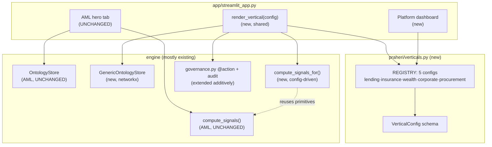
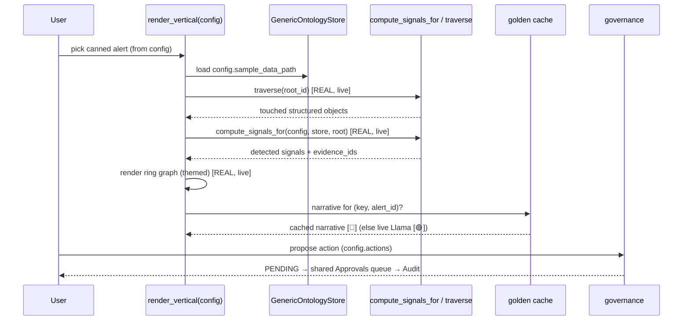

# feat: Multi-Vertical "Sovereign AIP OS" — config-driven verticals + Platform dashboard

**Created:** 2026-06-28
**Type:** feat
**Depth:** Deep (cross-cutting; new store abstraction, engine generalization, 5 verticals, Platform dashboard)
**Origin:** `docs/superpowers/specs/2026-06-28-praheri-multi-vertical-os-design.md` (approved brainstorm)
**Plan basis:** origin spec + direct read of `app/streamlit_app.py`, `praheri/agent.py`, `praheri/store.py`, `praheri/generate.py`, `praheri/models_procurement.py`, `praheri/governance.py`.

---

## 1. Summary

Turn Praheri from a single deep AML demo into a **config-driven multi-vertical platform** that *visibly* runs one engine across six sectors. AML stays the bespoke, fully-live hero (untouched). Five "shallow" verticals — Lending (EWS), Insurance (SIU claims fraud), Wealth (suitability/mis-selling), Corporate (UBO), and Procurement (migrated from today's hard-coded tab) — render through **one themeable `render_vertical(config)`** driven by a `VerticalConfig` cartridge. A **Platform dashboard** reads the same config registry to draw the kernel + cartridges + live counters ("1 engine · 6 ontologies · N object types · 0 lines of engine code changed per vertical").

The shallow verticals do **real** graph traversal + **real** signal detection on synthetic per-vertical data (the ring graph lights up live); only the Llama narrative is golden-cached for stage stability — the same Live/Cached pattern AML already uses.

---

## 2. Problem Frame

Praheri today *is* architecturally a domain-agnostic investigation engine, but it **presents** as a single-purpose AML tool: one bespoke Investigation tab plus one hard-coded Procurement tab. The platform thesis ("Sovereign AIP — an OS for financial services") is asserted in the pitch but not demonstrable on screen. A judge cannot click through sectors and *see* the same cockpit drive different domains.

The blocker to proving it is that the core read layer is AML-specific:
- `OntologyStore` (`praheri/store.py`) hard-codes AML object types in `_TABLE`, infers type from `ACC-`/`TXN-`/`DEV-` id prefixes in `_type_of()`, and hand-writes per-type neighbor SQL in `_linked_ids()` against AML tables (`account_devices`, `transactions`).
- `compute_signals()` (`praheri/agent.py`) hard-codes the three AML typologies (structuring, circular, shared-device).
- The Procurement tab (`app/streamlit_app.py` `tabs[4]`) is hand-built against `models_procurement` constants, sharing only the governance/audit engine — not the investigation cockpit.

So adding a vertical today means hand-building another tab — which is exactly the move that *weakens* the "one engine" pitch and multiplies stage risk.

**This plan's job:** introduce a generic, config-driven path *beside* the AML path (never rewriting it), so a new vertical is a config cartridge + synthetic data, not a new page.

---

## 3. Requirements & Success Criteria

Traceable to origin spec §1 (success criteria) and §11 (definition of done):

- **R1** — Six sector dashboards are clickable (AML + Lending + Insurance + Wealth + Corporate + Procurement); the five shallow ones render through one shared function and look identical by construction.
- **R2** — A Platform dashboard shows the engine box + 6 cartridge tiles + **live counters derived from the config registry** (counters cannot drift from reality).
- **R3** — The AML hero demo is **byte-for-byte unchanged** in behavior; the existing 52 tests stay green at every phase.
- **R4** — Each shallow vertical does **real** traversal + **real** signal detection on its synthetic data (ring graph lights up live); narrative is golden-cached (honest Live/Cached badge).
- **R5** — New verticals' mutations go **only** through `@action` in `governance.py`; every action writes to the same `audit_log.jsonl`. (CLAUDE.md golden rule #4/#5.)
- **R6** — Synthetic data only; deterministic generation (matches `generate.py` seeded pattern). (Golden rule #7.)
- **R7** — OAG preserved: every vertical's retrieval returns structured objects `{type, id, properties, linked_ids}`, never text blobs. (Golden rule #3.)
- **R8** — Engine generalization is **additive**: AML keeps calling `compute_signals()` and `investigate()` exactly as today; new generic entry points sit beside them.

**Out of scope** (origin §10): real integrations, document-extraction, multi-tenant RBAC/OAuth, fine-tuning, Docker/k8s, deepening any shallow vertical into a second flagship.

---

## 4. Key Technical Decisions

### KTD-1 — A new `GenericOntologyStore`, not an extension of `OntologyStore`
The existing `OntologyStore` is AML-schema-hardcoded (`_TABLE`, prefix `_type_of()`, per-type SQL `_linked_ids()`). Retrofitting it to be schema-driven would touch the AML hero's read path — unacceptable risk (violates R3). **Decision:** add a separate `GenericOntologyStore` (new file `praheri/vertical_store.py`) backed by an in-memory **networkx** graph built from a cartridge's node/edge lists. It exposes the **same** structured-object contract — `query_objects(type, **filters)`, `get_object(type, id)`, `get_linked_objects(id, link_type)`, `build_graph()` — returning the identical `{type, id, properties, linked_ids}` dict shape, so downstream traversal/signal/render code is store-agnostic. AML continues to use `OntologyStore`; shallow verticals use `GenericOntologyStore`. *Rationale:* maximum isolation, minimal new surface, and an in-memory graph is the right tool for ~30-object demo datasets (no SQL schema per vertical).

### KTD-2 — Config-driven detectors registered by id, reusing AML detector logic
Generalize signal detection via a new `compute_signals_for(config, store, root_id)` in a new module `praheri/vertical_engine.py`. It dispatches to detector functions named in `config.signals[*].id` from a small registry. **AML's `compute_signals()` stays untouched**; where a vertical's typology is structurally identical (e.g. shared-garage ring ≈ shared-device ring; shared-director stress ≈ shared-attribute cluster), the generic detector reuses the same graph primitive (`_has_cycle`, shared-neighbor counting) parameterized by node/edge type — not copy-pasted. *Rationale:* honors R8 (additive), and the reuse is itself the platform proof.

### KTD-3 — Migrate Procurement into the cartridge model as the first vertical
Today's hard-coded `tabs[4]` becomes `VerticalConfig` #1. This proves the pattern on code already trusted, makes the registry the single source of truth, and keeps the Platform counters honest. *Rationale:* (confirmed with user) leaving it bespoke would make the "6 cartridges" claim partly fictional.

### KTD-4 — Deterministic per-vertical synthetic data via one new generator
New `praheri/generate_verticals.py` produces small seeded datasets (one planted ring each) for the five shallow verticals, mirroring `generate.py`'s `random.seed` + `plant_*` structure. Data is written as JSON under `data/verticals/<key>.json` (loaded by `GenericOntologyStore`), keeping it inspectable and out of the AML SQLite DB. *Rationale:* determinism (R6), AML DB untouched, easy golden-cache priming.

### KTD-5 — Golden cache per vertical, same mechanism as AML
Reuse the `investigate()` cache pattern: `compute_vertical_investigation()` writes/reads `demo_cache/<vertical_key>__<alert_id>.json`. Real traversal + signals run live; the **narrative** field is served from cache when present. Honest "🟢 Live / 💾 Cached" badge as today. *Rationale:* R4 + stage stability (KTD-2 from the original build).

### KTD-6 — Theming via `accent_color`, polish deferred to P4
The shared renderer themes KPI cards and the ring-graph node palette from `config.accent_color`. Heavy `ui-ux-pro-max` polish is a dedicated late phase (P4) so the path works before it's beautified (golden rule: don't gold-plate before the path works).

---

## 5. High-Level Technical Design

### 5.1 Component map (after this plan)



### 5.2 Shallow-vertical investigation data flow



---

## 6. Output Structure (new files)

```
praheri/
  verticals.py            # VerticalConfig schema + REGISTRY (5 cartridges)
  vertical_store.py       # GenericOntologyStore (networkx, same contract as OntologyStore)
  vertical_engine.py      # compute_signals_for() + detector registry + compute_vertical_investigation()
  generate_verticals.py   # deterministic synthetic data for the 5 verticals
data/
  verticals/
    procurement.json
    lending.json
    insurance.json
    wealth.json
    corporate.json
demo_cache/
  <key>__<alert_id>.json  # primed narratives (per vertical)
app/
  streamlit_app.py        # + render_vertical(), + Platform dashboard, + nav (AML tab untouched)
tests/
  test_vertical_store.py
  test_vertical_engine.py
  test_verticals_config.py
  test_generate_verticals.py
  test_app_verticals.py   # AppTest render guards for each vertical + Platform
```

---

## 7. Implementation Units

Phases mirror origin §7 (P0–P5). **Commit per green unit.** The 52 existing tests must pass at the end of every unit; AML behavior is a regression gate throughout.

### U1. Scaffold `VerticalConfig` schema + empty registry (P0)
**Goal:** Define the cartridge contract with no behavior change anywhere.
**Requirements:** R1, R8.
**Dependencies:** none.
**Files:** `praheri/verticals.py` (new); `tests/test_verticals_config.py` (new).
**Approach:** Pydantic models exactly as origin §5.1: `ObjectTypeSpec`, `SignalSpec`, `ActionSpec`, `KPI`, `VerticalConfig`. Add an empty `REGISTRY: dict[str, VerticalConfig] = {}` and a `get_config(key)` accessor. No import into the app yet.
**Patterns to follow:** `praheri/models.py` and `praheri/models_procurement.py` (Pydantic `BaseModel`, type hints, module-level demo constants).
**Test scenarios:**
- A minimal valid `VerticalConfig` constructs and round-trips `.model_dump()`.
- Missing required field (e.g. `key`) raises `ValidationError`.
- `get_config("absent")` raises `KeyError` (or returns `None` — pick one, test it).
- `accent_color` accepts a hex string; `object_types`/`signals`/`actions` accept lists of their specs.
**Verification:** new tests pass; `pytest` total = 52 + new, all green; app unchanged.

### U2. `GenericOntologyStore` over networkx (P0)
**Goal:** A schema-free store exposing the same structured-object contract as `OntologyStore`, with **zero** change to `OntologyStore`.
**Requirements:** R3, R7, KTD-1.
**Dependencies:** U1.
**Files:** `praheri/vertical_store.py` (new); `tests/test_vertical_store.py` (new).
**Approach:** Construct from a dict of `{nodes: [{type,id,properties}], edges: [{from,to,link_type}]}`. Build a `networkx.DiGraph`. Implement `query_objects(type, **filters)`, `get_object(type, id)`, `get_linked_objects(id, link_type=None)`, `build_graph(ids=None)` — each returning the identical `{type, id, properties, linked_ids}` dict shape used by `OntologyStore._structured`. `linked_ids` is derived generically from edges (group neighbor ids by `link_type`, both directions with a reverse-name convention). Tolerate unknown `link_type` like the AML store (return all links rather than raise).
**Patterns to follow:** `OntologyStore._structured` / `_linked_ids` (match the output contract precisely); `build_graph` in `store.py` for the pyvis-compatible graph.
**Test scenarios:**
- Load a 5-node/4-edge fixture; `get_object` returns correct `{type,id,properties,linked_ids}`.
- `query_objects(type)` filters by type; `query_objects(type, prop=val)` filters by property equality.
- `get_linked_objects(id)` returns all neighbors; `get_linked_objects(id, link_type)` filters; unknown link_type returns all (no raise).
- `linked_ids` groups neighbor ids by link_type and includes reverse edges under a documented reverse name.
- `build_graph()` returns a graph whose nodes carry `kind`/`label` data usable by the existing `render_ring_graph` styling.
**Verification:** new tests pass; `OntologyStore` untouched (diff shows no change to `store.py`); 52 AML tests green.

### U3. `compute_signals_for()` + detector registry (P1)
**Goal:** Config-driven signal detection that reuses AML graph primitives, additively.
**Requirements:** R4, R8, KTD-2.
**Dependencies:** U2.
**Files:** `praheri/vertical_engine.py` (new); `tests/test_vertical_engine.py` (new).
**Approach:** `compute_signals_for(config, store, root_id) -> list[dict]` iterates `config.signals`, dispatching each `SignalSpec.id` to a detector in a module-level `DETECTORS` registry. Provide generic detectors parameterized by node/edge type: `shared_attribute_ring` (generalizes shared-device — count ≥N accounts sharing one hub node), `circular_flow` (reuses the cycle idea; import/extract `_has_cycle` so both AML and generic call one copy), `threshold_cluster` (generalizes structuring — ≥N sub-threshold inbound edges). Each detector returns the same signal dict shape AML emits: `{typology, detail, evidence_ids}`. **Do not modify `compute_signals()`**; if `_has_cycle` is extracted to a shared helper, AML imports the same helper (behavior-preserving — covered by existing tests).
**Patterns to follow:** `agent.compute_signals` (signal dict shape, evidence_ids, priority sort), `agent._has_cycle`.
**Execution note:** Extract `_has_cycle` test-first — add a characterization test asserting current AML behavior before moving it, so the move is provably behavior-preserving.
**Test scenarios:**
- `shared_attribute_ring`: a hub node with ≥ threshold neighbors fires; below threshold does not; evidence_ids include hub + members.
- `circular_flow`: a planted A→B→C→A cycle fires; an acyclic chain does not.
- `threshold_cluster`: ≥N sub-threshold inbound edges fire; mixed above/below counts correctly.
- `compute_signals_for` returns only signals whose detectors fired, in config order/priority.
- Covers R8: existing AML `compute_signals` tests still pass after `_has_cycle` extraction (regression).
- Unknown detector id in config raises a clear error at registry lookup (fail fast, not silent).
**Verification:** new tests pass; AML `compute_signals` characterization + existing tests green.

### U4. `render_vertical(config)` shared renderer + Procurement migration (P1)
**Goal:** One shared renderer; migrate the hard-coded Procurement tab to be its first cartridge (KTD-3).
**Requirements:** R1, R3, R5, R7, KTD-3, KTD-5.
**Dependencies:** U2, U3.
**Files:** `app/streamlit_app.py` (add `render_vertical`, Procurement config wiring; **AML tab untouched**); `praheri/verticals.py` (add procurement config to REGISTRY); `praheri/generate_verticals.py` (new — procurement dataset only in this unit); `data/verticals/procurement.json` (new); `tests/test_app_verticals.py` (new).
**Approach:** Implement `render_vertical(config)` rendering origin §5.2's six bands: hero band (icon/name/tagline/regulator chip themed by accent_color), KPI row, alert queue, Investigate→traverse+signals→themed ring graph, decision panel (signals + recommendation + cached/live narrative), govern (propose action → existing `PENDING` queue). Build the procurement `VerticalConfig` from existing `models_procurement` data (Vendor/Budget/Requisition/Contract → nodes/edges) and route its "Submit PO / over-budget" action through the **existing** `governance.approve_purchase_order`. Replace `tabs[4]` body with `render_vertical(get_config("procurement"))`. Reuse `render_ring_graph` (generalize its `_NODE_STYLE` lookup to accept config-provided kinds/colors, defaulting to current AML styles so AML is unaffected).
**Patterns to follow:** existing `tabs[1]` investigation layout and `tabs[4]` procurement logic (preserve the over-budget→MLRO behavior); `governance.approve_purchase_order`.
**Test scenarios:**
- `AppTest` renders the Procurement vertical without exception (render guard, mirrors existing app test).
- Procurement KPIs show budget remaining; an over-budget requisition routes to `PENDING_APPROVAL` (same assertion the current tab implies).
- `render_vertical` with the procurement config produces the six bands (assert key widgets/markers present).
- Proposing the procurement action creates a `PENDING` entry and an audit row.
- Regression: AML Investigation tab still renders (existing AppTest guard) — AML path unchanged.
**Verification:** Procurement renders via `render_vertical`; over-budget still gates to MLRO; AML demo identical; 52 + new tests green.

### U5. Synthetic data + cartridges for Insurance SIU and Lending EWS (P2)
**Goal:** Two more cartridges, each with real data + a planted ring.
**Requirements:** R1, R4, R6, R7.
**Dependencies:** U4.
**Files:** `praheri/generate_verticals.py` (add insurance + lending); `data/verticals/insurance.json`, `data/verticals/lending.json` (new); `praheri/verticals.py` (add both configs); `tests/test_generate_verticals.py` (new).
**Approach:** **Insurance SIU** ontology: Claim, Policy, Hospital/Garage, Claimant; planted **shared-garage ring** (≥5 claims through one garage) → reuses `shared_attribute_ring` detector; action `refer_to_siu` (requires approval). **Lending EWS** ontology: Borrower, Loan, Collateral, Director; planted **shared-director stress cluster** + EMI-bounce threshold → `shared_attribute_ring` + `threshold_cluster`; actions `margin_call`, `downgrade_rating`. Seed RNG (`random.seed`) per origin `generate.py` so datasets are byte-stable. Define each vertical's `actions` as real `@action`s (U7 wires governance; here they may map to generic governance actions — see U7 dependency note).
**Patterns to follow:** `generate.py` `plant_structuring` / `plant_shared_device` / `create_alerts_for_rings`.
**Test scenarios:**
- Generator is deterministic: running twice yields identical JSON (hash equality).
- Insurance dataset contains exactly one shared-garage ring of the configured size; `compute_signals_for` fires `shared_attribute_ring` on it.
- Lending dataset fires both `shared_attribute_ring` and `threshold_cluster`.
- Each dataset has ≥1 canned alert pointing at the ring root.
- Loading each JSON into `GenericOntologyStore` yields valid structured objects.
**Verification:** both verticals investigate end-to-end (traverse + signals + graph) with cached narrative; tests green.

### U6. Synthetic data + cartridges for Wealth and Corporate (P3)
**Goal:** Final two cartridges; all six verticals present in nav.
**Requirements:** R1, R4, R6, R7.
**Dependencies:** U5.
**Files:** `praheri/generate_verticals.py` (add wealth + corporate); `data/verticals/wealth.json`, `data/verticals/corporate.json` (new); `praheri/verticals.py` (add both configs); `app/streamlit_app.py` (add the 5 vertical tabs to nav, each `render_vertical(get_config(k))`); extend `tests/test_app_verticals.py`.
**Approach:** **Wealth** ontology: Customer, SuitabilityProfile, Product, Transaction, Adviser; signal = suitability-mismatch cluster (product risk > profile risk across ≥N sales) via `threshold_cluster`-style detector; action `flag_misselling` (requires approval). **Corporate** ontology: Company, Director, Shareholder, UBO, RelatedEntity; signal = circular ownership / shared-UBO cluster via `circular_flow` + `shared_attribute_ring`; action `escalate_kyc_review`. Add nav tabs; keep AML tab first and unchanged.
**Patterns to follow:** U5 generators; existing nav `st.tabs` block.
**Test scenarios:**
- Both generators deterministic (hash equality).
- Wealth fires the suitability-mismatch signal on planted mis-sales; Corporate fires the ownership-cycle / shared-UBO signal.
- `AppTest` renders all five shallow verticals + AML without exception.
- Each new vertical's propose-action creates a `PENDING` + audit row.
- Regression: AML tab unchanged; all prior verticals still render.
**Verification:** all six tabs render; each shallow vertical investigates end-to-end; tests green.

### U7. Wire vertical actions through governance additively (P3)
**Goal:** Every vertical action is a real governed `@action` writing to the shared audit log.
**Requirements:** R5, R8.
**Dependencies:** U4 (procurement action exists), U5, U6 (action ids defined).
**Files:** `praheri/governance.py` (add generic vertical actions additively); `tests/` (extend `test_vertical_engine.py` or a new `test_vertical_governance.py`).
**Approach:** Add a small set of generic governed actions (or one parameterized `propose_vertical_action(actor, vertical_key, action_id, target_id, reason, requires_approval)`) decorated with the existing `@action` so high-stakes ones (`requires_approval=True`) route to the same `PENDING` queue and `approve()` path. **Do not alter** the existing AML actions (`request_account_freeze`, `file_str`, etc.) or `approve_purchase_order`. Each call logs to `audit_log.jsonl` via the existing `log()`.
**Patterns to follow:** `governance.action` decorator, `request_account_freeze` (approval gate), `approve`, `log`.
**Test scenarios:**
- A `requires_approval=True` vertical action returns `PENDING_APPROVAL` and appears in `PENDING.list_pending()`.
- `approve(ref, mlro)` executes it and writes an audit entry with actor/timestamp/model.
- A non-approval action executes immediately and audits.
- Regression: existing AML action tests + approval tests unchanged and green.
**Verification:** propose→approve→audit works for every vertical through the **shared** queue; AML governance tests green.

### U8. Platform dashboard (P4)
**Goal:** The hero "OS" screen, with live counters derived from the registry (R2).
**Requirements:** R1, R2.
**Dependencies:** U6 (all configs registered).
**Files:** `app/streamlit_app.py` (add Platform tab, ideally first); extend `tests/test_app_verticals.py`.
**Approach:** Per origin §5.4: center engine box (Triage→Traverse→Detect→Decide→Govern→Audit, "unchanged across all verticals"); 6 clickable cartridge tiles (set `st.session_state` to jump to a vertical); live counters computed from `REGISTRY` — `len(REGISTRY)+1` ontologies (incl. AML), summed `object_types`, summed `link_types`, summed `actions`, and the literal "0 lines of engine code changed per vertical". The money line from §5.4 rendered on screen.
**Patterns to follow:** existing sidebar/markdown/metric usage in `streamlit_app.py`.
**Test scenarios:**
- `AppTest` renders the Platform tab without exception.
- Counters equal values computed directly from `REGISTRY` (assert the function, not hard-coded numbers — so they can't drift).
- Each cartridge tile, when clicked, sets the expected `session_state` target.
**Verification:** Platform renders; counters provably match the registry; tests green.

### U9. `ui-ux-pro-max` polish pass on the shared template (P4)
**Goal:** Make the shared template genuinely beautiful (bento cards, spacing, per-accent theming) without divergent per-vertical code.
**Requirements:** R1 (visual consistency = the proof), KTD-6.
**Dependencies:** U8.
**Files:** `app/streamlit_app.py` (styling within `render_vertical` + Platform); possibly a small CSS injection helper.
**Approach:** Load the `ui-ux-pro-max` skill; apply a consistent visual system (cards, typography, accent-driven palettes) to `render_vertical` and the Platform dashboard only. AML hero styling unchanged. No new per-vertical branches — theming stays config-driven.
**Patterns to follow:** the skill's design-token guidance; existing `_NODE_STYLE` for graph theming.
**Test scenarios:** `Test expectation: none — purely presentational.` Re-run all `AppTest` render guards to confirm no regressions (no exceptions on any tab).
**Verification:** all tabs render; styling applied uniformly; full suite green.

### U10. Prime golden caches + update demo script + rehearse (P5)
**Goal:** Crash-proof narratives for all verticals; the "swap a config → new sector" demo beat documented.
**Requirements:** R4, R3.
**Dependencies:** U9.
**Files:** `demo_cache/<key>__<alert_id>.json` (generated, committed); `docs/demo_script.md` (update); `praheri/vertical_engine.py` (ensure `compute_vertical_investigation` cache read/write per KTD-5); extend `tests/test_app_verticals.py` if needed.
**Approach:** Run each vertical investigation once with Ollama up to generate narratives, save to `demo_cache/`. Add the Platform → vertical-swap beat to the demo script (origin §11 order). Verify the full 6-tab click-through.
**Patterns to follow:** AML golden-cache priming in `investigate()`; `docs/demo_script.md` structure.
**Test scenarios:**
- With a primed cache present, `compute_vertical_investigation` returns `source="cached"` and the cached narrative (no live call).
- With no cache and Ollama unavailable, it degrades gracefully (signals + graph still render; narrative shows an honest fallback) — mirror AML `LlamaUnavailable` handling.
**Verification:** every vertical replays from cache in ~ms; AML hero + 5 verticals + Platform all land clean; 52 + all new tests green.

---

## 8. Sequencing & Phases

| Phase | Units | Gate |
|---|---|---|
| **P0** isolate + scaffold | U1, U2 | New store/contract beside AML; `store.py` untouched; 52 green. |
| **P1** renderer + first cartridge | U3, U4 | Procurement renders via `render_vertical`; AML identical. |
| **P2** two verticals | U5 | Insurance + Lending investigate end-to-end. |
| **P3** two verticals + governance | U6, U7 | All 6 tabs; every action governed + audited. |
| **P4** Platform + polish | U8, U9 | Counters match registry; template beautified. |
| **P5** caches + rehearse | U10 | Crash-proof replay; demo script updated. |

Commit per green unit (golden rule #8). AML regression gate (52 tests + AML AppTest render guard) runs every unit.

---

## 9. Risks & Mitigations

| Risk | Mitigation | Unit |
|---|---|---|
| Engine generalization breaks AML's bespoke path | KTD-1/KTD-2 keep AML code untouched; `_has_cycle` extraction is characterization-tested before the move | U2, U3 |
| `GenericOntologyStore` contract drifts from `OntologyStore`, breaking `render_ring_graph` | U2 tests assert the exact `{type,id,properties,linked_ids}` shape + graph node data the renderer expects | U2, U4 |
| 5 verticals balloon scope before 10 July | Shallow by design (1 ring each); each is a config + JSON, not a page; Procurement reuses existing data | U4–U6 |
| Shallow verticals "feel fake" | Real traversal + real signals + live themed ring graph; only narrative cached, with honest badge | U5, U6, U10 |
| Procurement migration regresses the over-budget→MLRO behavior | U4 test asserts `PENDING_APPROVAL` on over-budget, preserving current behavior | U4 |
| Streamlit `session_state` collisions across verticals | Namespace keys by `config.key` in `render_vertical` | U4 |

---

## 10. Deferred to Follow-Up Work
- Deepening any shallow vertical toward AML-level fidelity (origin §10).
- A shared abstract base for `OntologyStore`/`GenericOntologyStore` (only if a third store type ever appears — YAGNI now).
- Document-extraction layer for trade-finance/claims docs (origin §10).

---

## 11. Definition of Done (origin §11)
1. Platform dashboard: engine + 6 cartridges + live counters + the money line.
2. AML hero unchanged end-to-end.
3. Insurance SIU → same cockpit → garage ring lights up → propose "refer to SIU".
4. Lending / Wealth / Corporate / Procurement → same cockpit each → real ring + cached narrative.
5. The beat: "I swapped a config cartridge — that's the OS."
6. Sovereignty + OAG-vs-RAG beats still land.
7. 52 existing tests + all new tests green.
